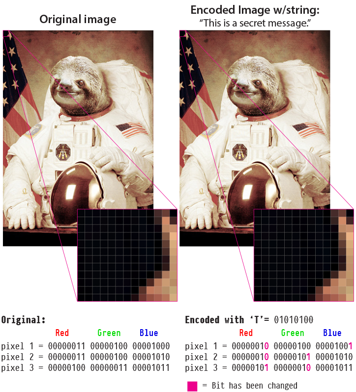

## Steganography functions for python

py_steno is a Steganography application that will encode() text into the binary data of a PNG image. It accomplishes this by modifying the least significant bits (LSB) in the RGB channels. Because each intensity value is only being changed ~0.3% it's not noticeable to the human eye and appears to be identical to the original. 